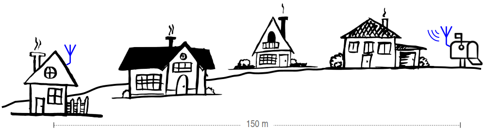
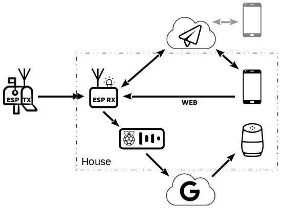

# ESP8266 Mailbox Notifier

### About

This program will notify you when someone opens your outdoor mailbox. Program features:

* [Notifications via LED, internal web site, Telegram or Google Home](https://github.com/denis-stepanov/esp8266-mailbox/wiki/Operation#notifications)
* [Support for multiple mailboxes (on receiver side)](https://github.com/denis-stepanov/esp8266-mailbox/wiki/Operation#front-page)
* [Log of events](https://github.com/denis-stepanov/esp8266-mailbox/wiki/Operation#event-log-page)

### Notification Flow

### Hardware

Hardware part is made with a pair of [ESP-01(S)](https://github.com/denis-stepanov/esp8266-mailbox/wiki/ESP-01), which rely on [HC-12](https://github.com/denis-stepanov/esp8266-mailbox/wiki/HC-12) radio modules for communication using [hand-made antennas](https://github.com/denis-stepanov/esp8266-mailbox/wiki/Antennas). Classical [reed switch](https://github.com/denis-stepanov/esp8266-mailbox/wiki/Schematics#remote-module-transmitter-mailbox) is used for door opening detection. Radio link works reliably at 150 m distance with quite some obstacles (trees and bungalow type houses). Remote (mailbox) module is powered with one [14250 battery](https://github.com/denis-stepanov/esp8266-mailbox/wiki/Battery) lasting for eight months on average (depends on the range and usage; the longest run so far has been 13.5 months). The [schematics](https://github.com/denis-stepanov/esp8266-mailbox/wiki/Schematics) are simple, especially for the receiver part.

Receiver (left) and transmitter (right) before installation, fit with some early testing antennas (enclosure - [TicTac](https://www.tictac.com)):

### Web Interface

### Telegram Interface

### Alright; How Do I Start?

Consult [Wiki](https://github.com/denis-stepanov/esp8266-mailbox/wiki) for [Getting Started](https://github.com/denis-stepanov/esp8266-mailbox/wiki/Getting-Started), [Schematics](https://github.com/denis-stepanov/esp8266-mailbox/wiki/Schematics) and details of [Operation](https://github.com/denis-stepanov/esp8266-mailbox/wiki/Operation).

### Project Status
January 2022: v3 is planned with important redesign of remote module. It will bring a PIR sensor to detect letters and small parcels and a more suitable controller ([ATtiny](https://github.com/SpenceKonde/megaTinyCore) instead of [ESP-01S](https://github.com/denis-stepanov/esp8266-mailbox/wiki/ESP-01)).
