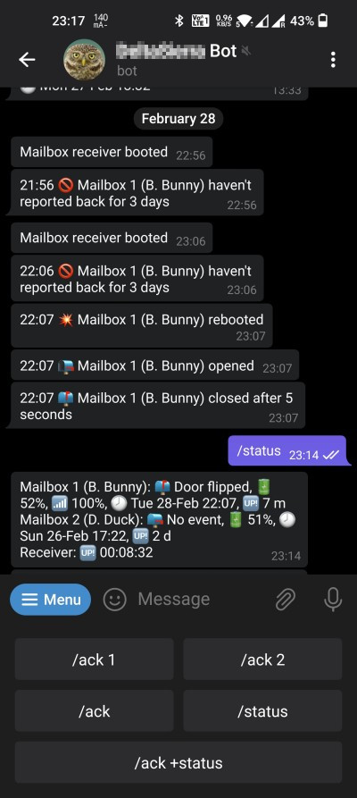

# ESP8266 Mailbox Notifier

### About

This program will notify you when someone opens your outdoor mailbox. Program features:

* [Notifications via LED, internal web site, Telegram or Google Home](https://github.com/denis-stepanov/esp8266-mailbox/wiki/Operation#notifications)
* Support for multiple mailboxes (on receiver side)
* [Log of events](https://github.com/denis-stepanov/esp8266-mailbox/wiki/Operation#event-log-page)

### Notification Flow

### Hardware

Hardware part is maid with a pair of [ESP-01(S)](https://github.com/denis-stepanov/esp8266-mailbox/wiki/ESP-01), which rely on [HC-12](https://github.com/denis-stepanov/esp8266-mailbox/wiki/HC-12) radio modules for communication using [hand-made antennas](https://github.com/denis-stepanov/esp8266-mailbox/wiki/Antennas). Classical reed switch is used for door opening detection. Radio link works reliably at 150 m distance with some light obstacles (trees and rooftops). Remote (mailbox) module is powered with one [14250 battery](https://github.com/denis-stepanov/esp8266-mailbox/wiki/Battery) lasting for three months. The [schematics](https://github.com/denis-stepanov/esp8266-mailbox/wiki/Schematics) are simple, especially for the receiver part.

Receiver (left) and transmitter (right) before installation, fit with some early testing antennas (enclosure - [TicTac](https://www.tictac.com)):

### Web Interface

### Telegram Interface

### Alright; How Do I Start?

Consult [Wiki](https://github.com/denis-stepanov/esp8266-mailbox/wiki) for [Getting Started](https://github.com/denis-stepanov/esp8266-mailbox/wiki/Getting-Started) and [Schematics](https://github.com/denis-stepanov/esp8266-mailbox/wiki/Schematics).
