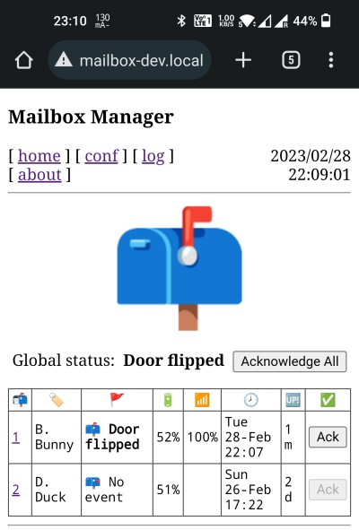

# esp8266-mailbox

This program will notify you when someone opens your outdoor mailbox. Program features:

* Notifications via LED, internal web site, Telegram or Google Assistant
* Support for multiple mailboxes
* Log of events

Hardware part is maid with a pair of ESP-01, which rely on HC-12 radio modules for communication using hand-made antennas. Classical reed sensor is used for door opening detection. Radio link works reliably at 150 m distance with some light obstacles (trees). Remote (mailbox) module is powered with one 14250 battery lasting for 8 months. The schematics are simple, especially for the receiver part.

Receiver (left) and transmitter (right) before installation (enclosure - [TicTac](https://www.tictac.com)):

Web interface:

Telegram interface:

Project dependencies are listed in [mailbox.ino](mailbox/mailbox.ino) file. Consult [Wiki](https://github.com/denis-stepanov/esp8266-mailbox/wiki) for detailed documentation and schematics.
